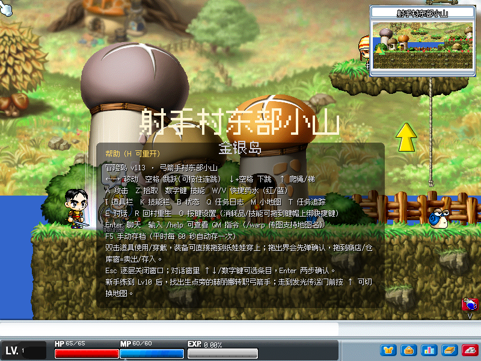
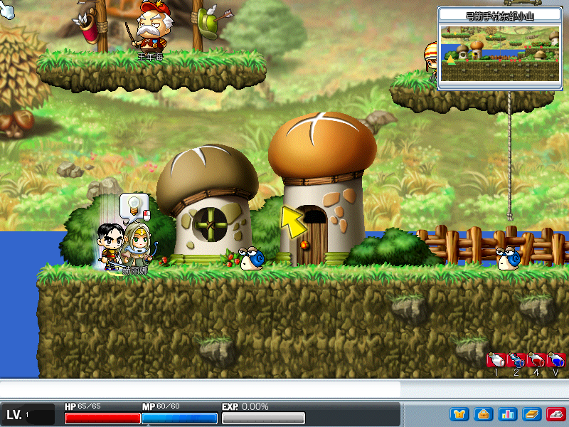
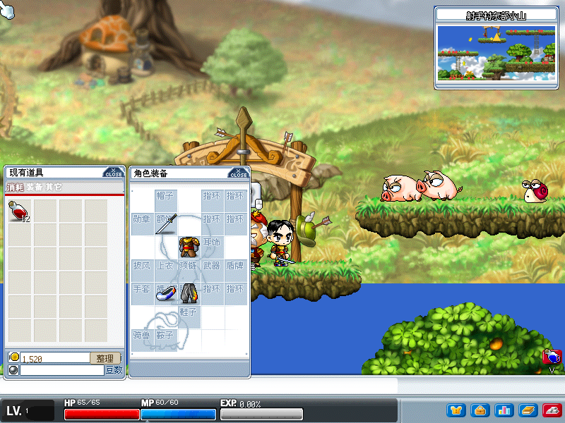
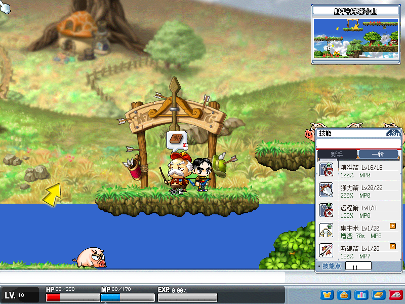
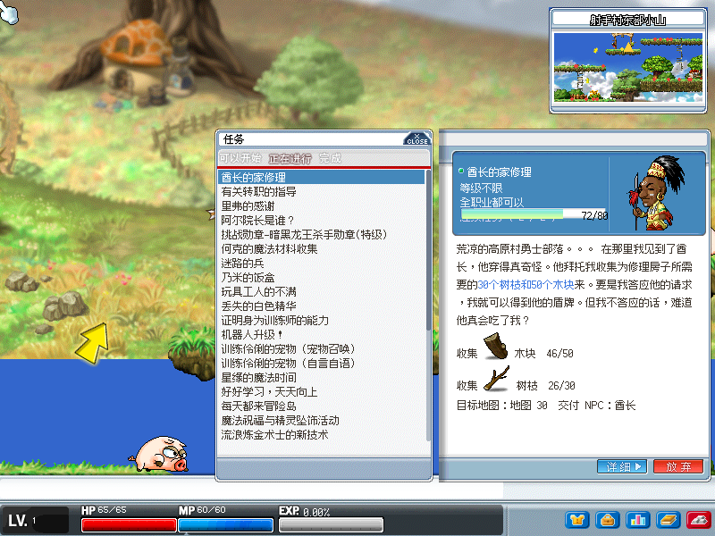
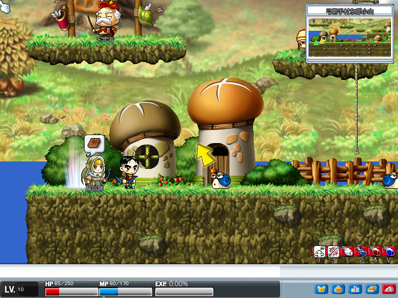

# MapleStory v113 · pygame 单机重制

以 Python + pygame 重制 MapleStory v113（台湾版）的单机版：直接读取官方 WZ 封存，重现地图场景、怪物、NPC、任务、技能与背包系统。

> 本项目只`读取` WZ 资产，任何时候都`不写入` `wz/` 文件夹。

## 游戏截图

| | |
|:--:|:--:|
|  |  |
| 开场欢迎对话 | 弓箭手村东部小山实机画面 |
|  |  |
| 道具栏（原版 UI 素材） | 技能栏 |
|  |  |
| 任务日志（含目标 NPC） | 关闭面板后的完整画面 |

截图可执行 `uv run python src/scripts/capture_screenshots.py` 重新生成至 `screenshots/`。

## 功能特色

- **WZ 资产解析**（自制 `wzpy` 函数库）：解密、属性树、图片解码，提供 Map / Mob / Character / NPC 渲染器与 JSON 导出
- **全地图连通**：地图间传送关系完全由 WZ 数据驱动（Map.wz 各 portal 的 tm/tn），取代旧白名单；从弓箭手村可漫游到 200+ 张相连地图
- **传送门还原**：普通门（pv 蓝色旋转动画）按 ↑ 切图、隐藏门（ph，不可见）按 ↑ 进入、同图瞬移门（psh 金色动画）原地瞬移不重载地图
- **异步地图加载**：切图时于背景线程预热素材缓存（LRU 容量预算），主线程不卡顿；相邻地图预加载 + 地图横幅
- **类 MS 三层物理**：foothold 平台、梯/绳（按 ↑/↓ 上下攀爬、顶端按 ↓ 直接下滑）、蹬墙跳、下跳穿板、落地吸附
- **即时战斗**：近战/远程（弓弩普攻与技能皆射出箭矢弹道，贴图取自原版箭矢物品）、技能施放（1/2 快捷）、怪物 AI（搜索/追踪/多层）、伤害数字与击退动作
- **任务系统**：Quest.wz 解析、非模态对话、NPC 任务灯泡、任务日志（杀怪／收集目标）
- **存档系统**：每 60 秒自动存档 + 关闭时写入 `saves/save.json`，重开自动接续进度
- **原版 UI**：道具栏 / 技能栏 / 任务日志 / 聊天框皆以 WZ UI 素材重绘，非模态对话框不暂停世界

## 需求

- Python ≥ 3.12
- 包管理：`uv`
- MapleStory v113（台湾版）WZ 文件，见下方「获取 WZ 资产」（仓库不提供）

## 获取 WZ 资产

本项目**不附带任何 WZ 文件**，需自行准备：

1. 前往 [MapleStoryUnity/wzData](https://github.com/MapleStoryUnity/wzData)，在 **TMS (Taiwan)** 一节下载 **113** 版本的 WZ 压缩包
2. 解压后，将其中全部 `.wz` 文件（Map.wz、Mob.wz、Character.wz、Npc.wz、String.wz、Sound.wz、UI.wz ……）复制到项目根目录的 `wz/` 文件夹下
3. 再执行下方的安装与启动命令

> `wz/` 目录本身会提交到仓库（仅含 `.gitkeep` 占位），目录内的 WZ 文件已被 gitignore，不会被提交。

## 安装与执行

```bash
uv sync            # 安装依赖（含 dev 组）
uv run python -m game.main   # 启动游戏
uv run pytest      # 跑测试
```

## 操作说明

| 按键 | 动作 |
|:--|:--|
| `←` / `→` | 移动（`A` / `D` 为攻击，不用于移动） |
| `Space` | 跳跃；绳/梯上按 `Space` 跳离 |
| `↑` | 爬绳／爬梯（站在发光传送门上按 `↑` 切换地图） |
| `↓` | 下绳／下梯；`↓` + `Space` 空中下跳穿板 |
| `A` | 攻击 |
| `1` ～ `9` | 施放技能 |
| `Z` | 拾取掉落物 |
| `F` | 使用药水 |
| `I` / `K` / `Q` / `B` | 道具栏 / 技能栏 / 任务日志 / 状态窗 |
| `M` | 开关小地图 |
| `Enter` | 与 NPC 对话（`Enter` / `Esc` 关闭非模态对话框） |
| `R` | 死亡后回出生点复活 |
| 滚轮 | 商店／仓库列表、背包／技能窗滚动 |

## 项目结构

```
src/wzpy/   函数库层：WZ 解析、解密、渲染器（可独立重复使用）
src/game/   应用层：游戏循环、物理、实体、战斗、技能、背包、任务、UI、存档
src/tests/  pytest 整合测试（合成数据，不需 WZ 文件）
wz/        WZ 原档（只读；目录纳入版本控制，WZ 文件本身未纳入）
screenshots/   README 用游戏截图
```

## 开发指引

- 模块 docstring、类别说明与代码注释一律使用**简体中文**
- 常量集中于 `src/game/settings.py`；实体物理热点类别使用 `__slots__`
- 新功能或修 bug 依循 TDD（见 `.agents/skills/tdd/`）：透过公开接口写整合测试，不用 mock
- 测试不得依赖 `wz/` 下 WZ 文件存在的环境，请以合成数据建构

## 授权与声明

- 本项目为个人学习用途的 MapleStory v113 重制示范，不附带任何 WZ 资产
- MapleStory 及其素材版权归 Nexon / Wizet 所有
