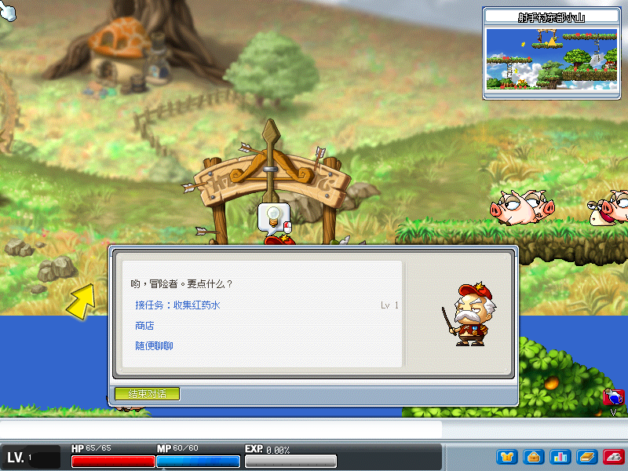

# 枫之谷 v113 · 单机重制

用 Python + Pygame 复刻 MapleStory v113（台服）：直接读取官方 WZ 资产，重现地图、怪物、NPC、任务、技能与背包。

> 只`读取` `resources/wz/` 下的官方资产，任何时候都`不写入`、不修改。


## 功能巡礼

### 世界与地图

地图连通由 WZ portal 数据决定，从弓箭手村出发可漫游 200+ 张相连地图；普通门、隐藏门、同图瞬移门全类型还原，切图后台预热缓存不卡顿。右上角小地图实时标示地形、传送门与周围玩家。

### 战斗

近战挥砍与弓弩弹道、技能施放与 buff、暴击与伤害飘字、怪物 AI 与击退——手感照原版调：foothold 平台行走、绳梯攀爬、蹬墙跳、下跳穿板。


### 任务与对话

NPC 对话由 Lua 脚本驱动，支持分段着色、蓝字链接与任务链流转；接取、进度、交付全程非模态，不打断行动。任务日志分「可接 / 进行中 / 可交付」追踪进度；商店、仓库、出租车传送也都从对话进入。

| NPC 对话 | 任务日志 |
|:--:|:--:|
|  |  |

### 角色与装备

原版素材的道具栏与纸娃娃：双击穿戴、拖拽扔物、装备强化卷轴；技能栏逐转加点、状态窗自由分配属性。金币拾取、商店买卖、仓库存取、按键全量可改绑、每 60 秒自动存档。


### 技能成长

Lv10 转职后开启新技能页签，SP 加点、快捷键绑定、被动加成即时生效。


截图可用 `uv run python src/scripts/capture_screenshots.py` 重新生成。

## 运行

需要 Python ≥ 3.12、`uv`，以及 v113（台服）WZ 文件（仓库不提供）：

1. 从 [MapleStoryUnity/wzData](https://github.com/MapleStoryUnity/wzData) 下载 TMS **113** 压缩包
2. 把全部 `.wz` 文件放进 `resources/wz/`（`resources/wz/` 目录入库、里头的 WZ 已 gitignore）

```bash
uv sync                      # 安装依赖
uv run python -m game.main   # 启动游戏
```

开局有欢迎指引对话，照做即可上手：


## 操作

| 按键 | 动作 |
|:--|:--|
| `←` `→` | 移动（`A` 攻击） |
| `Space` | 跳跃；绳梯上跳离 |
| `↑` `↓` | 爬绳梯 / 下绳梯；站传送门上 `↑` 切图；`↓`+`Space` 下跳 |
| `1`～`9` `Z` | 技能 / 拾取 |
| `I` `K` `Q` `B` `M` | 背包 / 技能 / 任务 / 状态 / 小地图 |
| `Enter` | 与 NPC 对话（`Enter`/`Esc` 关闭） |
| `R` | 死亡后回出生点复活 |

全部键位可在按键设置窗（`O`）中改绑；药品等消耗品可从背包直接拖到键上，按键即使用。

## 声明

个人学习用途的 MapleStory v113 重制示范，不附带任何 WZ 资产。MapleStory 及素材版权归 Nexon / Wizet 所有。

架构与开发规范见 [AGENTS.md](AGENTS.md)。
